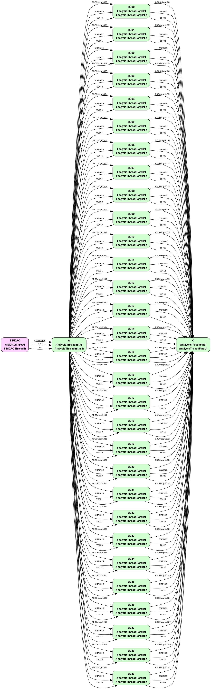

# Parallel Test Example

## Important Classes
  * SIMDAQThread
  * AnalysisThreadInitial
  * AnalysisThreadParallel
  * AnalysisThreadFinal

## Summary

This example is similar to the series example, except there are a large number of analysis threads in parallel rather than in series.  Data blocks for ADC, channel, and timestamps are split up by the Initial thread and passed to `NUM_ANALYSIS_THREADS` parallel threads, which then pass the data blocks on to the Final thread.  ADC histograms are displayed for the Initial and Final threads as well as the parallel threads.

The number of threads is specified in the calls to the `make_xml*.py` scripts in the pro file, as well as the `NUM_ANALYSIS_THREADS` constant in `main.cpp`.  These numbers must match or there will be run-time errors.

## Application Graph

